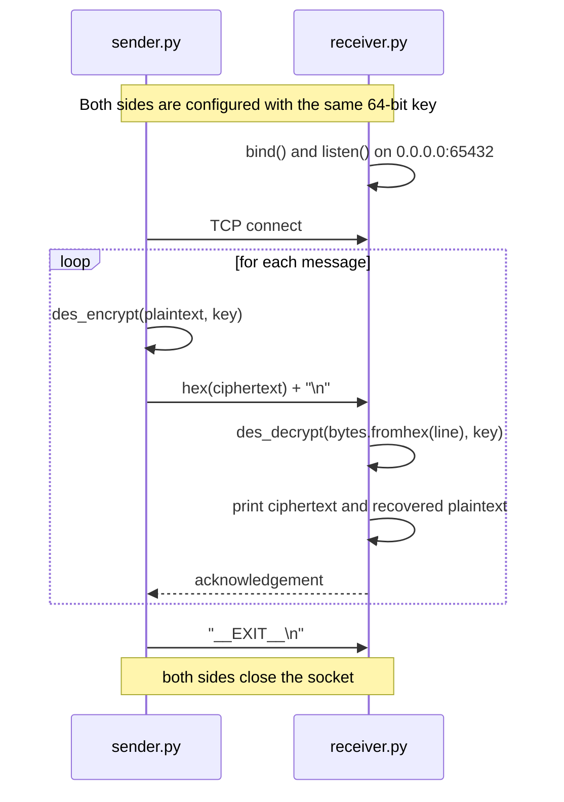

# DES Algorithm for Network Messaging

A from-scratch implementation of the **Data Encryption Standard (DES)** in pure Python, paired with a TCP client/server that exchanges DES-encrypted messages over a socket.

No cryptography libraries are used. Every part of the cipher — the permutation tables, the key schedule, the S-boxes, and all sixteen Feistel rounds — is implemented directly from the FIPS 46-3 specification.


> [!WARNING]
> **This project is for learning, not for protecting anything.**
> DES has a 56-bit effective key and has been considered cryptographically broken since the late 1990s — it is brute-forceable with modest hardware. This implementation also runs in ECB mode with no message authentication. Use AES-256-GCM or ChaCha20-Poly1305 (via a maintained library such as `cryptography`) for anything real. See [Security Considerations](#security-considerations).

---

## Why this exists

Calling `Cipher(algorithms.AES(key), modes.GCM(iv))` teaches you an API. Writing the S-box substitution by hand teaches you why a block cipher is built the way it is — why there is an expansion step, why the halves swap, why the key schedule shifts a different amount on different rounds.

This project was built to understand block cipher internals from the inside out, then to put the result to work carrying real messages across a network.

Originally developed as a lab assignment for **CMSE456 / CMPE455 (Network Security)** at Eastern Mediterranean University.

---

## Features

- **Complete DES implementation** — initial and inverse permutations, expansion function, all 8 S-boxes, permutation P, PC-1/PC-2 key schedule, and 16 Feistel rounds
- **Zero dependencies** — pure Python standard library, no `pycryptodome`, no `cryptography`
- **PKCS#5 padding** for arbitrary-length messages, with validation on unpad
- **TCP messaging layer** — a sender and a receiver that exchange encrypted messages over a socket
- **Verified against the official NIST/FIPS known-answer test vector**, plus per-stage tests for every transformation in the cipher

---

## How it works

### The cipher

Each 64-bit block travels through the standard DES pipeline:

```
        64-bit block                        64-bit key
             │                                   │
     ┌───────▼───────┐                   ┌───────▼───────┐
     │ Initial Perm. │                   │     PC-1      │  64 → 56 bits
     │      (IP)     │                   │ (drops parity)│
     └───────┬───────┘                   └───────┬───────┘
             │                                   │
      split into halves                    split into C₀ , D₀
             │                                   │
    ┌────────┴────────┐              ┌───────────▼───────────┐
    │  L₀ (32)  R₀(32)│              │  16 rounds of:        │
    └────────┬────────┘              │   left circular shift │
             │                       │   + PC-2  (56 → 48)   │
             │      ◄────────────────┤                       │
             │      K₁ … K₁₆ (48b)   └───────────────────────┘
    ┌────────▼────────┐
    │  16 Feistel     │      Lᵢ = Rᵢ₋₁
    │     rounds      │      Rᵢ = Lᵢ₋₁ ⊕ f(Rᵢ₋₁, Kᵢ)
    └────────┬────────┘
             │
      combine as R₁₆‖L₁₆      (final swap undone)
             │
     ┌───────▼───────┐
     │ Inverse Perm. │
     │    (IP⁻¹)     │
     └───────┬───────┘
             │
       64-bit ciphertext
```

The round function `f` itself is four steps: expand the 32-bit half to 48 bits with the E-table, XOR it with the round key, compress it back to 32 bits through the eight S-boxes, then apply permutation P.

Decryption is the same pipeline with the round keys applied in reverse order — the property that makes a Feistel network invertible without needing an inverse round function.

### The network protocol

The receiver listens; the sender connects. Both sides are given the same key by hand — there is no key exchange (see [Security Considerations](#security-considerations)). Messages are encrypted, hex-encoded, and sent newline-delimited.



The receiver buffers partial reads, so a message split across TCP segments is reassembled before decryption. If decryption or unpadding fails, the receiver replies with an error instead of dropping the connection.

---

## Repository structure

| File | Purpose |
|---|---|
| `des.py` | The cipher. Tables, key schedule, Feistel round, block encrypt/decrypt, PKCS#5 padding, and the public `des_encrypt` / `des_decrypt` API. No imports. |
| `sender.py` | TCP client. Prompts for target IP, port, and key; encrypts each message and sends it as hex. |
| `receiver.py` | TCP server. Prompts for listen IP, port, and key; decrypts each incoming message and acknowledges it. |
| `test_des.py` | Verification suite covering every transformation stage plus full encryption and decryption. |

---

## Getting started

### Requirements

Python 3.6 or newer. Nothing else.

```bash
git clone https://github.com/DogukanOrs/DES-Algorithm-for-Network-Messaging.git
cd DES-Algorithm-for-Network-Messaging
```

### Running the messaging demo

Open two terminals. **Start the receiver first** — it must be listening before the sender connects.

**Terminal 1 — receiver**

```bash
python receiver.py
```

```
Listen IP [0.0.0.0]:          ← press Enter for all interfaces
Port [65432]:                 ← press Enter
Key (16 hex chars) [133457799BBCDFF1]:
```

**Terminal 2 — sender**

```bash
python sender.py
```

```
Receiver IP [127.0.0.1]:      ← press Enter for localhost
Port [65432]:                 ← press Enter
Key (16 hex chars) [133457799BBCDFF1]:    ← must match the receiver
```

Type a message and press Enter. The sender shows the ciphertext it transmitted; the receiver shows the ciphertext it got and the plaintext it recovered. Type `exit` or `quit` to close both sides cleanly.

To run the two ends on different machines, start the receiver on the host and give the sender that host's IP address. Make sure port `65432` is reachable through the firewall.

### Using the cipher directly

`des.py` works standalone as a module:

```python
from des import des_encrypt, des_decrypt

key = bytes.fromhex("133457799BBCDFF1")   # exactly 8 bytes
ciphertext = des_encrypt(b"Hello DES over TCP!", key)
plaintext  = des_decrypt(ciphertext, key)

assert plaintext == b"Hello DES over TCP!"
```

`des_encrypt` pads the input to a multiple of 8 bytes with PKCS#5 and encrypts block by block. `des_decrypt` reverses it and validates the padding, raising `ValueError` on a malformed trailer. Both raise `ValueError` if the key is not exactly 8 bytes.

---

## Verification

```bash
python test_des.py
```

The suite validates each stage of the cipher separately rather than only checking the final output — so when something breaks, the failing test names the exact transformation at fault:

| Stage | What is checked |
|---|---|
| 2.1 – 2.2 | Initial permutation and its inverse |
| 2.3 | Expansion function (32 → 48 bits) |
| 2.4 | Key schedule — PC-1, the shift schedule, PC-2; all 16 round keys compared against expected values |
| 2.5 | XOR with the round key |
| 2.6 | S-box substitution (48 → 32 bits) |
| 2.7 | Permutation P |
| 2.8 – 2.9 | XOR with the left half, and the halves swap |
| 2.10 – 2.11 | Full block encryption and decryption |
| Bonus | Multi-block round-trip across padding boundaries |

The reference values come from the standard DES known-answer test vector:

```
Key         133457799BBCDFF1
Plaintext   0123456789ABCDEF
Ciphertext  85E813540F0AB405
```

---

## Security considerations

These are known and deliberate properties of an educational build. They are listed openly because knowing *why* a construction is unsafe is the point of writing one by hand.

**DES itself is obsolete.** The key is 64 bits, but PC-1 discards 8 parity bits, leaving 56 bits of real entropy. That search space fell to dedicated hardware in 1998 and is trivial for a modern GPU cluster. NIST withdrew DES in 2005.

**ECB mode leaks structure.** Each block is encrypted independently with no IV and no chaining, so identical plaintext blocks produce identical ciphertext blocks:

```
plaintext   AAAAAAAA AAAAAAAA AAAAAAAA
ciphertext  2E0E98D2 8892C3D2  ×3  ← the same block, three times
```

An attacker learns where repetitions occur in the message. CBC, CTR, or an AEAD mode such as GCM exists precisely to prevent this.

**No key exchange.** The key is typed into both ends by hand. A real system would derive a session key through Diffie–Hellman or a TLS handshake rather than relying on an out-of-band shared secret.

**No integrity or authenticity.** There is no MAC over the ciphertext, so a network attacker can flip bits in transit and the receiver cannot tell. In ECB, blocks can also be reordered, duplicated, or dropped undetected. Modern designs use authenticated encryption so decryption fails loudly when a message has been tampered with.

**No transport security.** The socket is plain TCP. Everything outside the message payload — connection metadata, timing, message sizes — is visible on the wire.

For production work, use a maintained library with AES-256-GCM or ChaCha20-Poly1305, a proper KDF for key derivation, and TLS for transport.

---

## Implementation notes

A few things worth flagging for anyone reading the source:

- **Bits are represented as Python lists of `0`/`1` integers**, not as packed integers or bytes. That is far slower than bitwise arithmetic, but it makes each permutation a single readable list comprehension (`[bits[t-1] for t in table]`) and keeps the code close to how the specification is written. Clarity was the goal, not throughput.
- **The final swap is handled by combining as `R₁₆ ‖ L₁₆`** rather than by swapping and then swapping back. This is the standard treatment and is what makes the same routine usable for decryption with reversed keys.
- **S-box addressing follows the specification's row/column split** — the outer two bits of each 6-bit chunk select the row, the inner four select the column.
- **PKCS#5 unpadding is validated**, not just truncated: the length byte is range-checked and every padding byte is verified before the trailer is removed.

---

## References

- [FIPS PUB 46-3 — Data Encryption Standard](https://csrc.nist.gov/files/pubs/fips/46-3/final/docs/fips46-3.pdf) (withdrawn, retained for reference)
- [NIST SP 800-67 Rev. 2](https://csrc.nist.gov/pubs/sp/800/67/r2/final) — on the deprecation of DES and TDEA
- [RFC 8018 §6.1](https://datatracker.ietf.org/doc/html/rfc8018#section-6.1) — PKCS#5 padding
- Bruce Schneier, *Applied Cryptography*, Chapter 12

---

## License

MIT — see [`LICENSE`](LICENSE).

---

**Author** — [Doğukan Bilal Örs](https://github.com/DogukanOrs)
